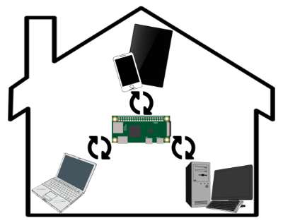
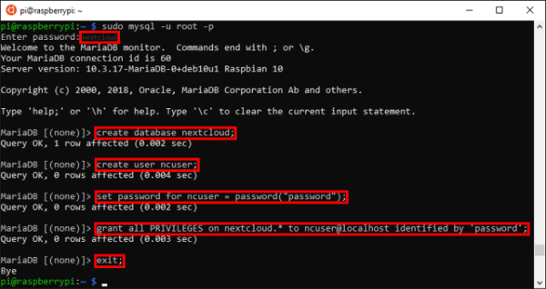
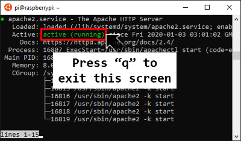
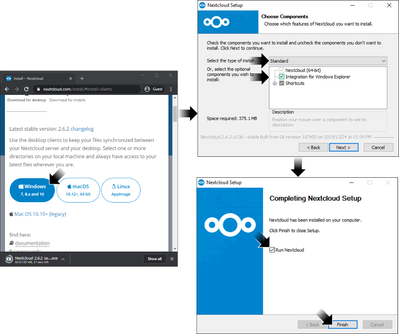
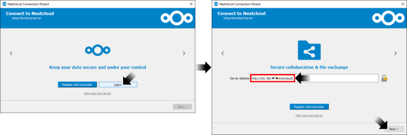
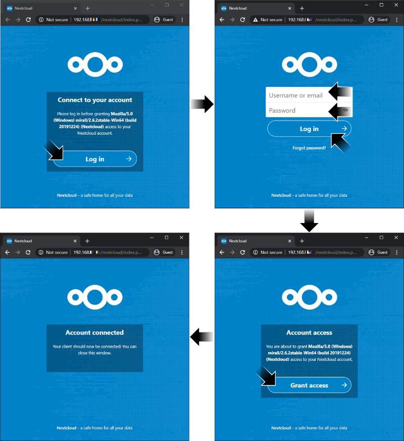
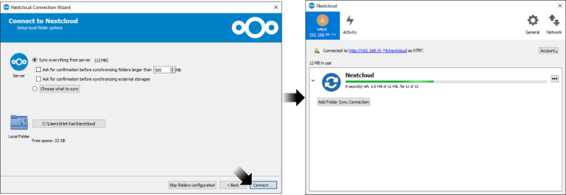
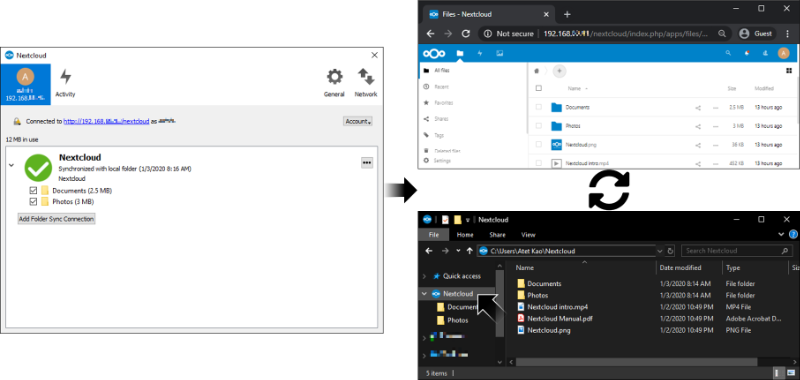

# [atet](https://github.com/atet) / [learn](https://github.com/atet/learn/blob/master/README.md#atet--learn) / [**_nas_**](https://github.com/atet/learn/blob/master/nas/README.md#atet--learn--nas)

[](#nolink)

# Introduction to Network Attached Storage

**This tutorial is part of my series on System Administration:<br>I highly recommend finishing my [15 Minute Introduction to Raspberry Pi](https://github.com/atet/learn/blob/master/raspberrypi/README.md#atet--learn--raspberrypi) to put this tutorial in better context**

**Estimated time to completion: 15 minutes**<br>(excluding waiting times for downloads and updates)

* This introduction to Network Attached Storage (NAS) only covers what's absolutely necessary to get you up and running
* You are here because **you want to setup a simple but powerful shared NAS**
* We will be using the free and open source Nextcloud service on the $10 Raspberry Pi Zero W

--------------------------------------------------------------------------------------------------

## Table of Contents

### Introduction

* [0. Requirements](#0-requirements)
* [1. Game Plan](#1-game-plan)
* [2. Pi: Installation, Connection, Update](#2-pi-installation-connection-update)
* [3. Nextcloud Server Installation](#3-nextcloud-server-installation)
* [4. Nextcloud Server Setup](#4-nextcloud-server-setup)
* [5. Nextcloud Client Installation](#5-nextcloud-client-installation)
* [6. Nextcloud Client Setup](#6-nextcloud-client-setup)
* [7. Epilogue](#7-epilogue)
* [8. Next Steps](#8-next-steps)

### Supplemental

* [Need More Power?](#need-more-power)
* [Other Resources](#other-resources)
* [Troubleshooting](#troubleshooting)
* [Acknowledgments](#acknowledgments)

--------------------------------------------------------------------------------------------------

## 0. Requirements

### Software

* Windows: This tutorial was developed on Microsoft Windows 10 with Windows Subsystem for Linux (WSL) and [Nextcloud v17.0.2](https://en.wikipedia.org/wiki/Nextcloud)
* MacOS: [Your Terminal program is Bash](https://en.wikipedia.org/wiki/Terminal_(macOS))
* Linux: I recommend Ubuntu 18.04 LTS

### Computer Hardware

* This tutorial uses the $10 Raspberry Pi Zero W ("wireless")
* You will also need a 5V micro USB cell phone charger and ≥8 GB microSD card

### WiFi Network

**The Raspberry Pi Zero W has specific WiFi requirements:**

* 2.4 GHz b/g/n WiFi-only
* Connect to WiFi using only the network name (a.k.a. SSID) and password
* Disabled ["wireless isolation" (a.k.a. AP isolation, station isolation, or client isolation)](https://www.howtogeek.com/179089/lock-down-your-wi-fi-network-with-your-routers-wireless-isolation-option/)

**Once you have everything here, you're ready to go!**

[Back to Top](#table-of-contents)

--------------------------------------------------------------------------------------------------

## 1. Game Plan

**This tutorial will setup your Raspberry Pi Zero W as a file server that will be accessible on your home network**

* Regardless of your personal data maintenance regime (backup, sharing, etc.), this tutorial is meant to reinforce IT and system administration (SysAdmin) tasks

[](#nolink)

* Upon completing this tutorial, you will make your Pi a central file server that can sync with multiple devices

[](#nolink)

[Back to Top](#table-of-contents)

--------------------------------------------------------------------------------------------------

## 2. Pi: Installation, Connection, Update

**You must set up your Raspberry Pi Zero W using the following instructions**

* Please follow sections 2 and 4 in [Atet's 15 Minute Introduction to Raspberry Pi](https://github.com/atet/learn/blob/master/raspberrypi/README.md#atet--learn--raspberrypi):

   2. [Installation](https://github.com/atet/learn/tree/master/raspberrypi#2-installation)
   3. [Connection](https://github.com/atet/learn/tree/master/raspberrypi#3-connection)
   4. [Updating](https://github.com/atet/learn/tree/master/raspberrypi#4-updating)

* If you have any issues, please see [Troubleshooting for Raspberry Pi](https://github.com/atet/learn/tree/master/raspberrypi#troubleshooting)
* Take note of your Raspberry Pi's current IP address for later

[Back to Top](#table-of-contents)

--------------------------------------------------------------------------------------------------

## 3. Nextcloud Server Installation

### 3.1. Installing dependencies

#### 3.1.1. MariaDB database 

* **Log into your Raspberry Pi**
* Download and install MariaDB; a high performance database that Nextcloud requires to store data

```
$ sudo apt install -y mariadb-server-10.3 && \
  sudo /usr/bin/mysql_secure_installation
```

* Enter the following in the `mysql_secure_installation`:
   * There is no current password for root, just press Enter
   * Set root password: type "`y`"
   * Enter "`nextcloud`" as the password for now (password is invisible for security)
   * Answer the remainder of questions with "`y`"

[](#nolink)

* Create a new database for Nextcloud in MariaDB
* Enter the password you made earlier
* Once you execute "`sudo mysql -u root -p`", you will start the terminal for MariaDB, enter each line after "`>`" one at a time until you exit MariaDB:

```
$ sudo mysql -u root -p

### ENTER PASSWORD YOU MADE IN PREVIOUS STEP ###

> create database nextcloud;
> create user ncuser;
> set password for ncuser = password("password");
> grant all PRIVILEGES on nextcloud.* to ncuser@localhost identified by 'password';
> exit;
```

[](#nolink)

#### 3.1.2. Apache web server and PHP tools

* Download and install Apache; a high performance web server that Nextcloud requires for a web interface

```
$ sudo apt install -y apache2 \
  php php-gd php-curl php-zip php-xml \
  php-mbstring libapache2-mod-php \
  python-mysqldb php-mysql && \
  sudo service apache2 restart
```

### 3.2. Nextcloud server

* Download and extract the latest version of Nextcloud: https://nextcloud.com/changelog/
* Version used in this tutorial is 17.0.2 (as of Jan. 4, 2020)

```
$ cd /var/www/html && \
  sudo wget https://download.nextcloud.com/server/releases/nextcloud-17.0.2.tar.bz2 && \
  sudo tar -xvjf nextcloud-17.0.2.tar.bz2
```

### 3.3. Permissions

* The "`apache2`" service must be "`active (running)`" after this set of commands
* **Exit from the status screen by pressing "`q`"**

```
$ sudo mkdir -p /var/www/html/nextcloud/data && \
  sudo chown www-data:www-data /var/www/html/nextcloud/data && \
  sudo chmod 750 /var/www/html/nextcloud/data && \
  cd /var/www/html/nextcloud && \
  sudo chown www-data:www-data config apps && \
  sudo service apache2 restart && \
  sudo service apache2 status
```

[](#nolink)

**You are now done with accessing the Pi through command line, the remaining steps will be on your local computer**

[Back to Top](#table-of-contents)

--------------------------------------------------------------------------------------------------

## 4. Nextcloud Server Setup

* In your web browser, navigate to "`http://<PI'S IP ADDRESS>/nextcloud`"
* Choose a username and password for the administrator account and remember it for the Client Setup step 6
* The default Data Folder path should be correct: "`/var/www/html/nextcloud/data`"
* Scroll down to continue setup
* Fill out the MariaDB database information from earlier:
   * Database User: "`ncuser`"
   * Database password: "`password`"
   * Database name: "`nextcloud`"
   * localhost: Keep as "`localhost`"
* Press "Finish setup" (this will take ~5 minutes)

[](#nolink)

* Once completed, you will be presented with a brief overview of Nextcloud (browse the overview or click X to exit)

[](#nolink)

* Briefly explore the Nextcloud's web-based interface
* Notice that you can upload and manage files through this graphical user interface (GUI)
* **Log out without changing any settings at this time**

[](#nolink)

[Back to Top](#table-of-contents)

--------------------------------------------------------------------------------------------------

## 5. Nextcloud Client Installation

* Download the latest version of Nextcloud client: https://nextcloud.com/install/#install-clients
* Continue with all the default settings during the installation
* Once completed, choose to "Run Nextcloud" 

[](#nolink)

[Back to Top](#table-of-contents)

--------------------------------------------------------------------------------------------------

## 6. Nextcloud Client Setup

* Once the Nextcloud application starts, select "Login"
* Log into your Nextcloud Pi server with: "`http://<PI'S IP ADDRESS>/nextcloud/`"
   * You must use "`http://`" and "`/nextcloud/`"

[](#nolink)

* Nextcloud will now attempt to authenticate with your Pi
* Your web browser should pop up with the login page for your Nextcloud server
* Login with your username and password you chose in step 4
* Choose "Grant access"

[](#nolink)

* Once your client has successfully authenticated, a final setup window will appear (leave as default for now)
* Nextcloud server will now sync to your local directory

[](#nolink)

* Once syncing is complete, you can use your Nextcloud directory in File Explorer just like any other normal directory (move files into/out of, delete files, etc.)
* **This directory is seamlessly synced with your Nextcloud server**

[](#nolink)

### Cleanup

* You can uninstall the Nextcloud Client just like any other program in Windows
* For the Pi server, I would recommend formatting the entire SD card if you want to start over or try another project

[Back to Top](#table-of-contents)

--------------------------------------------------------------------------------------------------

## 7. Epilogue

**As a web-based file sharing service, Nextcloud is flexible enough to fit most needs:**

* **Web-based graphical user interface** (GUI): Even if you don't integrate Nextcloud into Windows, you can use the web GUI to upload and manage files
* **Windows integration**: Nextcloud will work quietly in the background to actively sync and backup your files

**For long term solutions, consider the following:**

* **Better hardware**: You've experienced the Pi Zero being a bit sluggish
* **Reliable storage**: Micro SD card is not as reliable as traditional disk drives
* **Faster connection**: Zero W's WiFi bandwidth is slow compared to wired ethernet
* **Security**: Never expose a computer to the internet without taking precautions: https://www.upguard.com/blog/10-essential-steps-for-configuring-a-new-server

**Pro-tips:**

* **Backup and redundancy**: You can mirror your files on multiple devices just by connecting to a common account
* **Buy better hardware**: Don't use the Pi Zero as an actual Nextcloud NAS; it will be painfully slow and disk drives offer more storage and reliability than micro SD

[Back to Top](#table-of-contents)

--------------------------------------------------------------------------------------------------

## 8. Next Steps

**We touched on a bunch of different IT tasks here; you're easily on your way to becoming a self-sufficient ["techie"](https://www.merriam-webster.com/dictionary/techie), it just takes a lot of experimenting and completing projects like this**

* Try this tutorial one more time to solidify these concepts
* **I highly recommend continuing with another mini project: [Atet's 15 Minute Introduction to Virtualization](https://github.com/atet/learn/blob/master/virtual/README.md#atet--learn--virtual)**
* Now that you already have a Raspberry Pi, try some other fun projects: https://projects.raspberrypi.org/en/
* Trying to go back to sleep at 3AM? Read the official Raspberry Pi starter guide: https://projects.raspberrypi.org/en/pathways/getting-started-with-raspberry-pi

[Back to Top](#table-of-contents)

--------------------------------------------------------------------------------------------------

## Need More Power?

* The Raspberry Pi Zero is amazing for its price point, [but it was pretty slow handling Nextcloud](https://www.reddit.com/r/NextCloud/comments/6shc9a/can_i_run_nextcloud_on_a_pi_zero/?utm_source=share&utm_medium=web2x); this brand has other more powerful and more expensive computers if you need the horsepower

> [](#nolink)
>
> WDLabs enclosure for Raspberry Pi Model B and 2.5-inch disk drive

[Back to Top](#table-of-contents)

--------------------------------------------------------------------------------------------------

## Other Resources

Description | Link
--- | ---
Official Raspberry Pi Help | https://www.raspberrypi.org/help/
Official Nextcloud 17 Server Installation | https://docs.nextcloud.com/server/17/admin_manual/installation/command_line_installation.html
Official Raspberry Pi Getting Started Guide | https://projects.raspberrypi.org/en/pathways/getting-started-with-raspberry-pi
Official Raspberry Pi Project Ideas | https://projects.raspberrypi.org/en/

[Back to Top](#table-of-contents)

--------------------------------------------------------------------------------------------------

## Troubleshooting

Issue | Solution
--- | ---
Nextcloud web GUI seems to be hanging/frozen | Just wait, the Raspberry Pi Zero is not a supercomputer
Nextcloud client cannot authenticate with the Pi server | Make sure you are using "`http://`" in the address and NOT "`https://`", also you need to add the "`/nextcloud/`" in the address

[Back to Top](#table-of-contents)

--------------------------------------------------------------------------------------------------

## Acknowledgments

1. Nextcloud, the free, open-source file hosting service: <a href="https://nextcloud.com/" target="_blank">https://nextcloud.com/</a>

[Back to Top](#table-of-contents)

--------------------------------------------------------------------------------------------------

<p align="center">Copyright © 2019-∞ Athit Kao, <a href="http://www.athitkao.com/tos.html" target="_blank">Terms and Conditions</a></p>