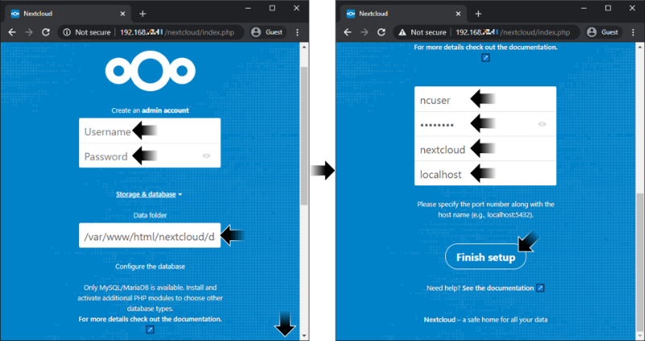

# [atet](https://github.com/atet) / [learn](https://github.com/atet/learn) / [**_nas_**](https://github.com/atet/learn/tree/master/nas)

[](#nolink)

# Introduction to Network Attached Storage (INCOMPLETE)

**Estimated time to completion: 15 minutes**<br>(excluding waiting times for downloads and updates)

* This introduction to Network Attached Storage (NAS) only covers what's absolutely necessary to get you up and running
* You are here because **you want to setup a simple but powerful shared NAS**
* We will be using the [free and open source Nextcloud service](https://en.wikipedia.org/wiki/Nextcloud) on the $10 Raspberry Pi Zero W

--------------------------------------------------------------------------------------------------

## Table of Contents

### Introduction

* [0. Requirements](#0-requirements)
* [1. Game Plan](#1-game-plan)
* [2. Pi: Installation, Connection, Update](#2-pi-installation-connection-update)
* [3. Nextcloud Server Installation](#3-nextcloud-server-installation)
* [4. Nextcloud Server Setup](#4-nextcloud-server-setup)
* [5. Nextcloud Client Installation](#5-nextcloud-client-installation)
* [6. Nextcloud Client Setup](#6-nextcloud-client-setup)
* [7. Next Steps](#7-next-steps)

### Supplemental

* [Why Raspberry Pi?](#why-raspberry-pi)
* [Other Resources](#other-resources)
* [Troubleshooting](#troubleshooting)
* [Acknowledgments](#acknowledgments)

--------------------------------------------------------------------------------------------------

## 0. Requirements

**This is part of a two-tutorial series on System Administration: I recommend to first finish [Atet's 15 Minute Tutorial on Raspberry Pi](https://github.com/atet/learn/blob/master/raspberrypi/README.md#atet--learn--raspberrypi) to put this content in better context**

### Software

* Windows: This tutorial was developed on Microsoft Windows 10 with Windows Subsystem for Linux (WSL)
* MacOS: [Your Terminal program is Bash](https://en.wikipedia.org/wiki/Terminal_(macOS))
* Linux: I recommend Ubuntu 18.04 LTS

### Computer Hardware

* This tutorial uses the $10 Raspberry Pi Zero W ("wireless")
* You will also need a 5V micro USB cell phone charger and ≥8 GB microSD card

### WiFi Network

**The Raspberry Pi Zero W has specific WiFi requirements:**

* 2.4 GHz b/g/n WiFi-only
* Connect to WiFi using only the network name (a.k.a. SSID) and password
* Disabled ["wireless isolation" (a.k.a. AP isolation, station isolation, or client isolation)](https://www.howtogeek.com/179089/lock-down-your-wi-fi-network-with-your-routers-wireless-isolation-option/)

**Once you have everything here, you're ready to go!**

[Back to Top](#table-of-contents)

--------------------------------------------------------------------------------------------------

## 1. Game Plan

[](#nolink)

* Regardless of your personal data maintenance regime (backup, sharing, etc.), this tutorial is meant to reinforce IT and system administration (SysAdmin) tasks
* Hopefully, setting up the network attached storage (NAS) service in this tutorial is useful enough for you to incorporate into your personal routine

[](#nolink)

* This tutorial will setup your Raspberry Pi Zero W as a file server that will be accessible to anyone on your home network
* This will not interfere with existing NAS on your network

[Back to Top](#table-of-contents)

--------------------------------------------------------------------------------------------------

## 2. Pi: Installation, Connection, Update

* Please follow sections 2 and 3 in [Atet's 15 Minute Introduction to Raspberry Pi](https://github.com/atet/learn/blob/master/raspberrypi/README.md#atet--learn--raspberrypi):

2. [Installation](https://github.com/atet/learn/tree/master/raspberrypi#2-installation)
3. [Connection](https://github.com/atet/learn/tree/master/raspberrypi#3-connection)

* If you have any issues, please see [Troubleshooting for Raspberry Pi](https://github.com/atet/learn/tree/master/raspberrypi#troubleshooting)
* Take note of your Raspberry Pi's current IP address for later

[Back to Top](#table-of-contents)

--------------------------------------------------------------------------------------------------

## 3. Update

* Let's update where the operating system will look for updates:

```
$ sudo apt-get update
```

* **You must re-run the above line** if you see any issues like:

```
.
.
.
1: Network is unreachable) [IP: 93.93.128.193 80]
E: Unable to fetch some archives, maybe run apt-get update or try with --fix-missing?
pi@raspberrypi:~ $ _
```

* You must make sure that "`sudo apt-get update`" ran successfully above
* Now let's actually update any programs that are not at their latest version:
   * Coffee break: This will take ~10 mins. and you don't need to babysit

```
$ sudo apt-get -y upgrade
```

[Back to Top](#table-of-contents)

--------------------------------------------------------------------------------------------------

## 3. Nextcloud Server Installation

* First some dependencies:


```
sudo apt-get -y install mariadb-server-10.3
```

```
$ sudo apt-get -y install apache2 \
  libapr1-dev libaprutil1-dev libfcgi-dev \
  libssl-dev zlib1g-dev libcurl4-openssl-dev \
  
  libapache2-mod-php7.3 \

  php7.3-apc

  php7.3-fpm php7.3 php7.3-xml php7.3-cgi php7.3-cli php7.3-gd php7.3-curl php7.3-zip php7.3-mysql php7.3-mbstring

  sqlite php7.3-sqlite3 \
  sudo service apache2 restart && \
  sudo service apache2 status
```

* The "`apache2`" service must be "`active (running)`"
* You can quit this screen by pressing "`q`"

[](#nolink)

* Download and extract the latest version of Nextcloud (v17.0.2 as of Jan. 1, 2020)

```
$ sudo mkdir -p /var/www/html/nextcloud/data && \
  sudo chown -R www-data:www-data /var/www/html/nextcloud/ && \
  sudo chmod 750 /var/www/html/nextcloud/data && \
  sudo touch /var/log/nextcloud.log && \
  sudo chown www-data /var/log/nextcloud.log && \
  cd /var/www/html && \
  sudo wget https://download.nextcloud.com/server/releases/nextcloud-17.0.2.tar.bz2 && \
  sudo tar -xvjf nextcloud-17.0.2.tar.bz2
```

[Back to Top](#table-of-contents)

--------------------------------------------------------------------------------------------------

## 4. Nextcloud Server Setup

* In your web browser, navigate to "`http://<PI'S IP ADDRESS>/nextcloud`"

[Back to Top](#table-of-contents)

--------------------------------------------------------------------------------------------------

## 5. Nextcloud Client Installation

[Back to Top](#table-of-contents)

--------------------------------------------------------------------------------------------------

## 6. Nextcloud Client Setup

[Back to Top](#table-of-contents)

--------------------------------------------------------------------------------------------------

## 7. Next Steps

**We touched on a bunch of different IT tasks here; you're easily on your way to becoming a self-sufficient ["techie"](https://www.merriam-webster.com/dictionary/techie), it just takes a lot of experimenting and completing projects like this**

* Try this tutorial one more time to solidify these concepts
* Now that you already have a Raspberry Pi, try some other fun projects: https://projects.raspberrypi.org/en/
* Trying to go back to sleep at 3AM? Read the official Raspberry Pi starter guide: https://projects.raspberrypi.org/en/pathways/getting-started-with-raspberry-pi

**If you would like to learn more about Bash and command line interface (CLI), please see [Atet's 15 Minute Introduction to Regular Expressions (in Bash)](https://github.com/atet/learn/blob/master/regex/README.md#atet--learn--regex)**

[Back to Top](#table-of-contents)

--------------------------------------------------------------------------------------------------

## Why Raspberry Pi?

* **_Trust me on this one_**: There's a huge difference in your learning experience when the brand you're working with has sold 10+ million computers vs. lesser-known alternatives that may be a _bit_ cheaper
* With a larger userbase, there's reliable community and official support, bugs get fixed quicker, you can expect timely updates, etc.
* The Raspberry Pi Zero is amazing for its price point, [but it's not going to play Crysis](https://en.wikipedia.org/wiki/Crysis_(video_game)#Legacy); this brand has other more powerful and more expensive computers if you need the horsepower

> [](#nolink)
>
> Raspberry Pi 4 Model B

[Back to Top](#table-of-contents)

--------------------------------------------------------------------------------------------------

## Other Resources

Description | Link
--- | ---
Official Raspberry Pi Help | https://www.raspberrypi.org/help/
Official Nextcloud 17 Server Installation | https://docs.nextcloud.com/server/17/admin_manual/installation/command_line_installation.html
Official Raspberry Pi Getting Started Guide | https://projects.raspberrypi.org/en/pathways/getting-started-with-raspberry-pi
Official Raspberry Pi Project Ideas | https://projects.raspberrypi.org/en/

[Back to Top](#table-of-contents)

--------------------------------------------------------------------------------------------------

## Troubleshooting

Issue | Solution
--- | ---
Is Nextcloud supported on ARMv6 (e.g. Raspberry Pi Zero W)? | Yes, https://help.nextcloud.com/t/raspberry-pi-zero-w-unsupported/44910/6

[Back to Top](#table-of-contents)

--------------------------------------------------------------------------------------------------

## Acknowledgments

1. Nextcloud, the free, open-source file hosting service: <a href="https://nextcloud.com/" target="_blank">https://nextcloud.com/</a>

[Back to Top](#table-of-contents)

--------------------------------------------------------------------------------------------------

<p align="center">Copyright © 2019-∞ Athit Kao, <a href="http://www.athitkao.com/tos.html" target="_blank">Terms and Conditions</a></p>